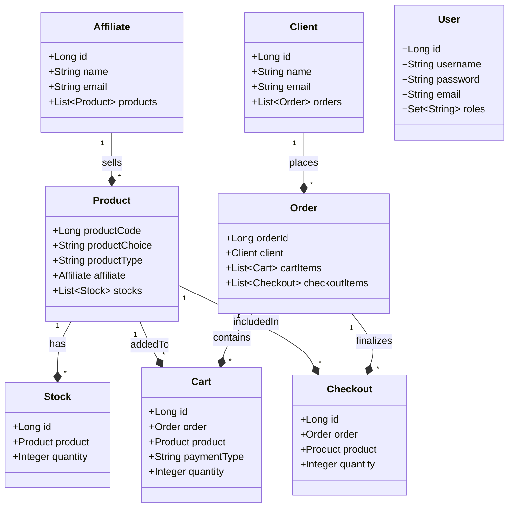

# java-avanade
Projeto Java com Spring Boot para a Avanade Decola Tech 2025

## Diagrama de Classes

```mermaid
classDiagram
    class Affiliate {
        +Long id
        +String name
        +String email
        +List~Product~ products
    }
    
    class Product {
        +Long productCode
        +String productChoice
        +String productType
        +Affiliate affiliate
        +List~Stock~ stocks
    }
    
    class Stock {
        +Long id
        +Product product
        +Integer quantity
    }
    
    class Client {
        +Long id
        +String name
        +String email
        +List~Order~ orders
    }
    
    class Order {
        +Long orderId
        +Client client
        +List~Cart~ cartItems
        +List~Checkout~ checkoutItems
    }
    
    class Cart {
        +Long id
        +Order order
        +Product product
        +String paymentType
        +Integer quantity
    }
    
    class Checkout {
        +Long id
        +Order order
        +Product product
        +Integer quantity
    }
    
    class User {
        +Long id
        +String username
        +String password
        +String email
        +Set~String~ roles
    }
    
    %% Relacionamentos
    Affiliate "1" --* "*" Product : sells
    Product "1" --* "*" Stock : has
    Product "1" --* "*" Cart : addedTo
    Product "1" --* "*" Checkout : includedIn
    Client "1" --* "*" Order : places
    Order "1" --* "*" Cart : contains
    Order "1" --* "*" Checkout : finalizes
```
